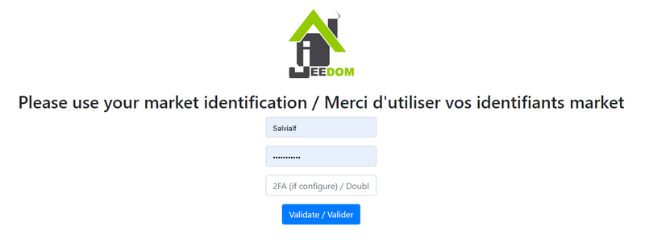
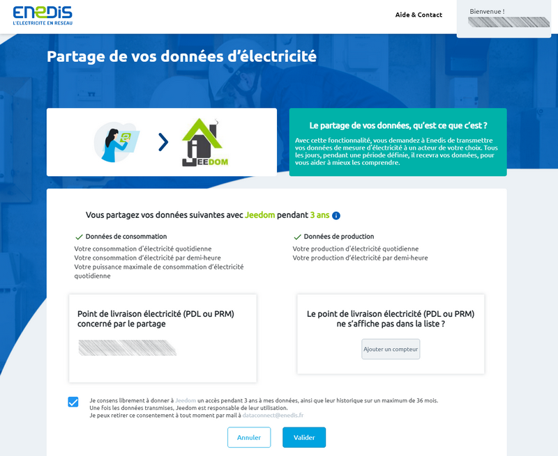
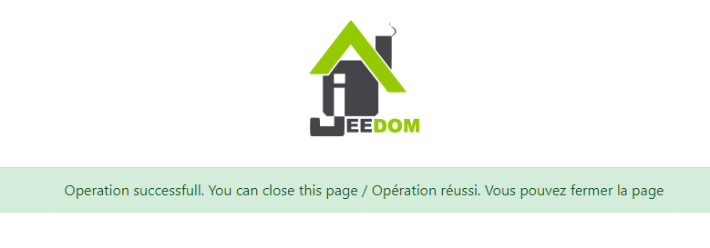

# Enedis Linky Plugin

# Description

Plugin zur Wiederherstellung von Stromverbrauchsdaten von intelligenten Zählern *(Linky zum Beispiel)* durch die Befragung der [Kundenkonto **Enedis**](https://mon-compte.enedis.fr/auth/XUI/#login/&realm=/enedis&forward=true){:target = "\_ leer"}.

>**Wichtig**
>
>Das Plugin wurde im Februar 2021 komplett neu geschrieben **die offizielle Enedis Data-Connect API**. Wenn Sie das Plugin zuvor verwendet haben, laden wir Sie ein, ein neues Gerät zu erstellen oder alle Steuerelemente eines früheren Geräts zu löschen.

Es ist möglich, auf Daten von zuzugreifen **Verbrauch**, von **Produktion** oder zu den 2 Messarten direkt in einem Gerät.

Für jede Messart werden 5 Daten angegeben :
- die **stündlicher Verbrauch** pro halbe Stunde *(in kW)*.
>*Diese Daten werden auch als "Verbrauchskurve" oder "Stromaufnahme" bezeichnet und geben die von all Ihren elektrischen Geräten im Durchschnitt über eine halbe Stunde benötigte Leistung zurück.*

- die **Täglicher Verbrauch** *(in kWh)*.
- die **monatlicher Verbrauch** *(in kWh)*.
- die **Jahresverbrauch** *(in kWh)*.
- die **maximale Kraft** *(in kVA)*.

>**INFORMATION**  
>    
>Da die Daten nicht in Echtzeit verfügbar sind, ruft das Plugin die Stromverbrauchsdaten vom Vortag ab.

# Configuration

## Plugin Konfiguration

Das Plugin **Enedis Linky** erfordert keine spezielle Konfiguration und sollte erst nach der Installation aktiviert werden.

Solange das Plugin nicht alle Daten vom Vortag abgerufen hat, werden die Server weiterhin stündlich zwischen 17.00 und 20.00 Uhr abgefragt. Andernfalls werden Anrufe bis zum nächsten Tag ausgesetzt.

Um die Enedis-Server nicht zu überlasten, werden Anrufe in zufälliger Minute getätigt, die auf der Konfigurationsseite des Plugins angezeigt oder geändert werden können.

## Gerätekonfiguration

Zugriff auf die verschiedenen Geräte **Enedis Linky**, Gehe zum Menü **Plugins → Energie → Enedis Linky**.

>**INFORMATION**
>    
>Die Schaltfläche **+ Hinzufügen** Ermöglicht das Hinzufügen eines neuen Messgeräts / einer neuen PDL.

Wenn Sie dies noch nicht getan haben, autorisieren Sie zunächst die Freigabe von Enedis-Daten mit Jeedom, indem Sie auf die Schaltfläche klicken **Verbinde Enedis mit Jeedom : Ich greife auf meinen Enedis-Kundenbereich zu** :      

Sie werden dann zu dieser Seite weitergeleitet, auf der Sie informieren müssen **Ihre Anmeldedaten für den Jeedom-Markt** Klicken Sie dann auf die Schaltfläche **Bestätigen** :      

Weiterleitung zur Enedis-Einwilligungsseite, auf der dies erforderlich ist **Aktivieren Sie das Kontrollkästchen** und klicken Sie auf **Bestätigen** :     

Sobald die Datenfreigabe überprüft wurde, wird diese Seite angezeigt :     

>**Wichtig**
>    
>Wenn Sie auf keine dieser Seiten zugreifen können, deaktivieren Sie den Browser-Werbeblocker.

Nachdem die Datenfreigabe autorisiert wurde, müssen Sie lediglich die Identifikationsnummer des betreffenden Lieferpunkts eingeben *(PDL)* und die Art der zu erholenden Messung.

Beim ersten Speichern der Geräte erstellt das Plugin automatisch die erforderlichen Befehle und integriert die auf der Enedis-Website verfügbaren Historien bis zu 3 Jahren.

>**TIPP**
>
>Wenn das Plugin aus dem einen oder anderen Grund die Historien beim Erstellen der Bestellungen nicht abrufen konnte, reicht es aus, die Bestellungen zu löschen und dann die Ausrüstung zu speichern, um die Bestellungen und ihre Historie erneut zu generieren.

>**INFORMATION**
>
>Die stündlichen Verbrauchsdaten werden höchstens in den letzten 7 Tagen abgerufen.

# Widget-Vorlage

Das Plugin bietet die Möglichkeit, Verbrauchs- und / oder Produktionsdaten in einer Widget-Vorlage anzuzeigen, die das Erscheinungsbild eines Zählers imitiert *Linky*. Der Klick auf die Schaltfläche "**- | +**" ermöglicht den Wechsel vom Verbrauch zur Produktion für diejenigen, die Zugang zu zwei Arten von Maßnahmen haben.

Um diese Option zu aktivieren, aktivieren Sie einfach das Kontrollkästchen **Widget-Vorlage** auf der allgemeinen Seite der betreffenden Ausrüstung. Sobald das Kontrollkästchen aktiviert ist, können Sie mit einer Option die Hintergrundfarbe des Widgets auswählen.

>**INFORMATION**
>     
>Die Widget-Vorlage wird sowohl auf Desktop- als auch auf Mobilversionen angezeigt.

>**TIPP**
>     
>In der Desktop-Version passen sich die im Widget angezeigten Informationen an die Größe an, wenn die Größe der Kachel geändert wird.

# Changelog

[Siehe das Änderungsprotokoll](https:\ / \ / doc.jeedom.com \ /#language#\ / plugins \ / energy \ / enedis \ / changelog)
